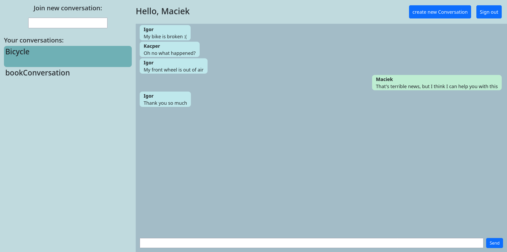

# Chat Application Backend

Real-time chatting application. This repository contains only a webserver. Application gui can be found here: 
https://github.com/WaShindeiru/ChatAngular

## Features

* Real-time communication using websocket
* Creating new users and conversations
* Sending messages to users/conversations

## Gallery

<div>

</div>

## Tools I used:

* Java
* Spring
* Websocket
* Hibernate

## Getting Started

### Prerequisites
* Docker
* Docker-compose

### Build Instructions

Make sure you are in a project directory, then run:

```bash
docker-compose build
docker-compose up
```

### Demo users:
username:
* Maciek
* Igor
* Ola

All demo users have the following password:
- 123

To stop the container run:
```bash
docker-compose down
```

If you want to use the gui follow the steps listed here: 
https://github.com/WaShindeiru/ChatAngular